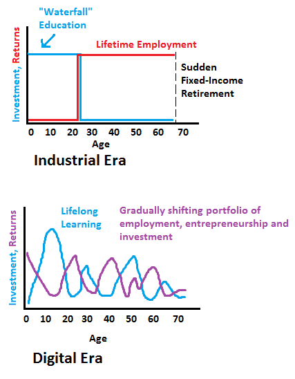
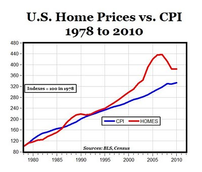
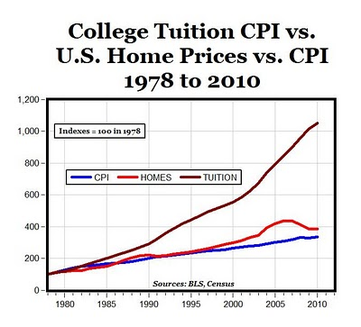

Later this week, I'll be presenting on my company [Eduglu][0] and product [Eduglu][1] at [Launchup][2], a local entrepreneurship event. In preparing for my presentation, I've stepped back again and revisited my reasons for why I started Eduglu and why I think it's needed.  

  

I see three trends which are starting to dramatically change how we learn and how that learning happens.  

  

### The changing nature of learning  

Today's educational system was designed when the expectation was that for most people, what they learned in school was sufficient to make them good employees for the remainder of their working career. If you started as an accountant in 1860 and retired 40 years later, at the end of your career you could expect that most of the knowledge you learned in school was still useful.  

  

Today, that is very much not the case. Knowledge is growing exponentially and the "[half-life][3] [of knowledge][4]" has shrunken dramatically. Whereas 100 years ago, one large investment of schooling at the beginning of our lives was enough to last an entire career, now we need to getting smaller chunks of schooling throughout our lives. We'll continually transition between investing in learning and harvesting the rewards of those learnings.   

  

\[Graph from "[The Emerging Principles of Lifelong Learning][5]" by [@vgr][6]\]  

  

  

An example of this I recently came across. I was talking to a client of mine about the industry they work in, [medical insurance coding.][7] Coding is the process of transforming a doctor's description of a medical visit into universal medical code numbers. My client who provide a number of training courses on doing coding, were telling me about the coming change in United States from the international coding standard ICD9 to ICD-10\. An enormous number of people involved with coding will need to receive new training to learn the new standards.  

  

This is a great example of what is happening because of the shortened half-life of knowledge. Our knowledge is increasing rapidly about the human body and how to treat its problems. Because of this growth in knowledge, standards about how to describe diagnosis and procedures became outdated and were revised. Because of this coming shift to new coding standards, many people will need new training.  

  

This same pattern is repeating across dozens of industries. Supporting this sorts of short semi-continuous online classes is a major focus for Eduglu.   

  

### Higher Ed Bubble  

The current educational system is unsustainable and needs a pruning. It's a bubble fueled by cheap federal student loans and is perilously similar to the housing bubble we recently lived through.   

  

I ran across [these two graphs][8] today which illustrate the problem well:  

  

**Housing bubble**  

  

  

**Higher Ed Bubble**  

  

  

If [the bubble does pop][9] and students start to shy away from high priced colleges and look for cheaper alternatives, more and more will look towards the pioneering online schools who provide most of the value of traditional universities with far more flexibility and far less cost.  

  

### Demand for higher education outgrowing ability to build new schools  

As the world becomes wealthier, 100s of millions of youth are beginning to demand access to higher education. In India alone, it was estimated that provide higher education to the same percentage the population as in United States, they would need to build nearly 2400 new universities in the next 25 years or roughly 2 per week.   

  

Building that many schools is clearly impossible. Traditional face-to-face educational models can't scale affordably to meet that sort of demand. New models need to be developed that can operate at the low costs and large scale required  

  

http://www.col.org/resources/speeches/2007presentations/Pages/2007-massTertiaryEd.aspx  

how to educate far more people for far less resources? 10x numbers of students for the same amount of resources?

[0]: http://eduglu.com
[1]: http://eduglu.com/download-eduglu
[2]: http://www.launchup.org/2010/08/31/eduglu-qa/
[3]: http://en.wikipedia.org/wiki/Half-life_of_knowledge
[4]: http://www.elearnspace.org/Articles/connectivism.htm
[5]: http://blog.trailmeme.com/2010/06/the-emerging-principles-of-lifelong-learning/
[6]: http://twitter.com/vgr
[7]: http://en.wikipedia.org/wiki/Medical_classification
[8]: http://mjperry.blogspot.com/2010/06/higher-education-bubble-its-about-to.html#
[9]: http://www.washingtonexaminer.com/opinion/columns/Sunday_Reflections/Higher-education_s-bubble-is-about-to-burst-95639354.html